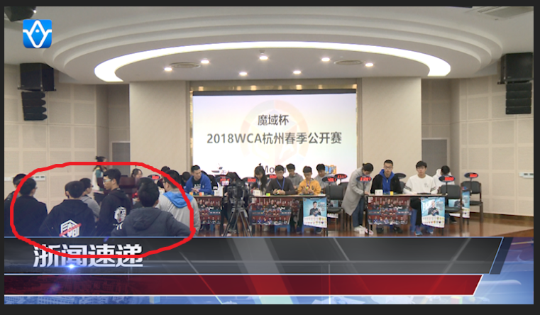
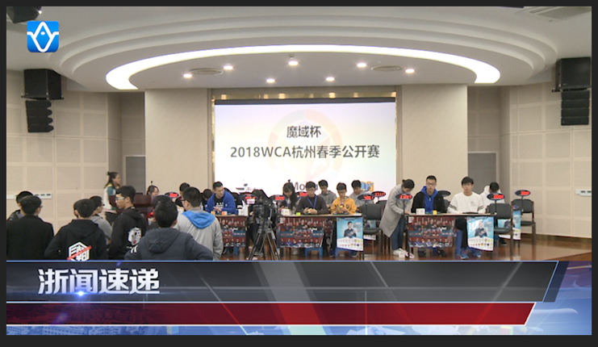
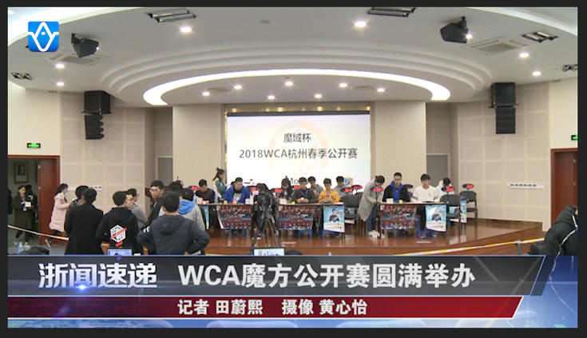
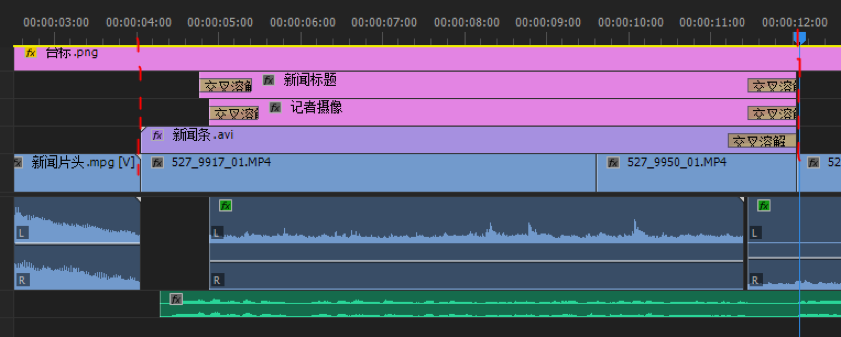
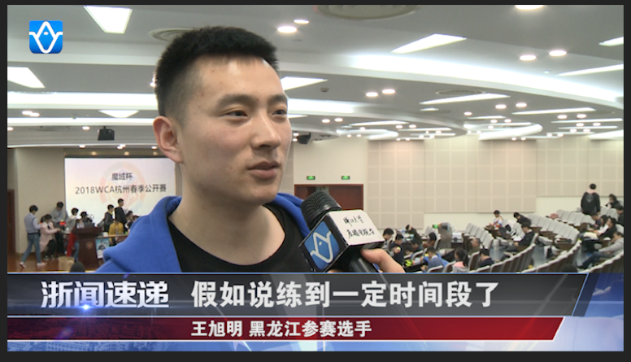
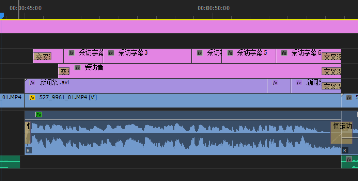
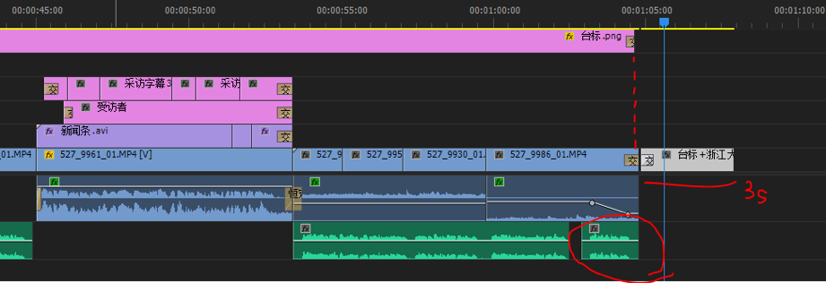

# 新闻规范——从拍摄到成片

<!-- 可能会随时更新qaq我也不知道我会忘记写啥重要的东西 -->

## 拍摄准备

1. 设备取用【**请务必填写设备取用表**】
   * 摄像机及**有电的**电池
   * **存储卡**
   * 话筒及接收器（或无线麦及接收器）
   * 三脚架及**快装板**
   * 5号电池（如不够请教超购买并保存小票报销）
   * 工作证（如有需要请带）
   * 白纸（如需对白平衡请自带）

2. 常见问题
   * 存储卡需要**格式化**，避免拍摄过程中出现空间不够的情况
   * 摄像机状态是否正常，如：是否在**full auto**模式、**灰片（ND滤镜）**是否归零、**增益**是否归零等

## 拍摄过程

1. 画面的构图合理，**白平衡、曝光、对焦**正确
2. 摄像机音频输入选择与话筒/无线麦接收器连接的插口对应，如：当连接到channel 1时，摄像机应在channel 1处选择ext
3. 注意举话筒时手臂位置、话筒位置、台标方向，记者尽量避免戴帽子，避免帽子或者脸出现在镜头内
4. 脚架高度根据画面随时调整，如为采访镜头，则应避免仰拍、俯拍
5. 记者需要记录采访对象信息

## 拍摄结束

1. 摄像相关
   * 请在存储卡写入完成之后再**关机**
   * 关闭话筒/无线麦**接收器**
   * 关闭镜头盖
   * 如有使用灰片、增益等，请归零，避免影响下一位使用机器的同学
   * 回台前检查设备是否都带回来了
   * 回台后请将所有设备放回原位，并及时将素材导出
2. 记者相关
   * **关闭话筒**

## 素材归置

1. 回台后**立刻**将素材导出！！！

2. 素材归置规范

   每次任务都需新建一个独立的主文件夹，存放位置与命名格式如下所示：
   **新闻素材库/2019/20190915青春歌会**

   之后在主文件夹内新建一个文件夹，命名为**素材**；如只有一台机器的素材，则可直接放在素材文件夹内，如有多台机器，请在素材文件夹下分别建立新文件夹，并标注清晰易懂的名字。
   例：**新闻素材库/2019/20190915青春歌会/素材/FS5/xxxxx.MXF**

   项目文件直接保存在主文件夹下。

3. 设备委员将定期上传素材至**NAS**，如因未按规范存放素材文件导致素材丢失，责任由该任务的摄像承担。

## 新闻规范

### 浙闻速递

1. **台标**从视频开始就出现，置于所有图层最上方，参数如下：

2. **新闻片头.MPG**从视频开始就出现，源文件音量过高，调整为-3dB

    

3. 导入**新闻条**，一般新闻条时长在6-8秒左右，跟首句新闻稿配合

   

   再用“裁剪效果”剪切新闻条上的光晕，顶部裁剪77%

    

   

   这样就没有光晕了

4. **标题和记者**

   

   上下两行字左对齐，每行字都要居于横条的上下正中央。

   横坐标没有硬性要求，与“**浙闻速递**”字样有一定距离即可，不要超出新闻条的右边。

   （因为标题出现次数较少且无需过多更改，建议采用“**旧版标题**”）

   **新闻标题**：方正大黑简体，80号字

   **记者摄像**：方正大黑简体，50号字（记者/摄像与后面的姓名中间隔一个半角空格，记者姓名和摄像姓名中间隔四个半角空格）

   在时间轴中，注意新闻标题、记者摄像姓名要滞后于新闻条出现。标题、记者姓名出现和结束都要加“**交叉溶解**“效果，时长大致如下：

   

   一般情况下，新闻条出现的时长跟首句配音稿一致（上图中绿色音轨为配音稿），不宜太短（8秒左右或以上为宜），如果时长不够，可以裁剪新闻条后半部分进行复制粘贴。

5. **新闻画面和现场音**

   新闻画面不要使用交叉溶解效果，直接衔接即可。适度插入现场音，注意使用“**恒定功率**”调整音频间的衔接。

    

6. **采访字幕**

   因为单条新闻中采访时长较短，故统一采用旧版标题。

   

   

   可以复制之前的新闻标题和记者摄像姓名，在“**项目**”中修改他们的名字（否则直接更改文字会改变前面的文字）。直接拖到时间轴中，位置同上。

   字幕出现前后、新闻条结束时都要使用交叉溶解效果。

   新闻条时长较短，用裁剪、复制粘贴的形式补充时长。

   一行字幕不要超过11个字（根据内容可适当调整，但不要太多）。

   **采访字幕**：方正大黑简体，80号字

   **受访者信息**：方正大黑简体，50号字（受访者姓名在前，隔一个半角空格，受访者头衔在后）

7. **结尾部分**

   

   配音稿最后一句为“**浙大电视台记者报道**”，可以适当与前一句拉开一些。

   最后一个新闻画面结束后，要使用交叉溶解效果结束，时长视情况自由把握，不需太长。

   台标比新闻画面早一点结束，使用较短的交叉溶解效果。

   新闻画面结束后，空**两帧**，插入浙江大学广播电视台厂牌（文件名为“**台标+浙江大学广播电视台.jpeg**“），总时长为3秒，出现时采用时长为10帧的交叉溶解，结尾不要溶解。